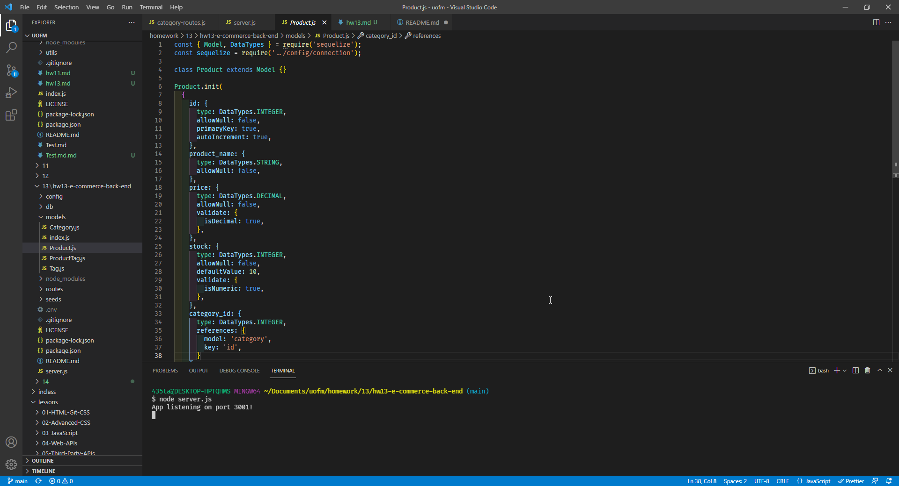
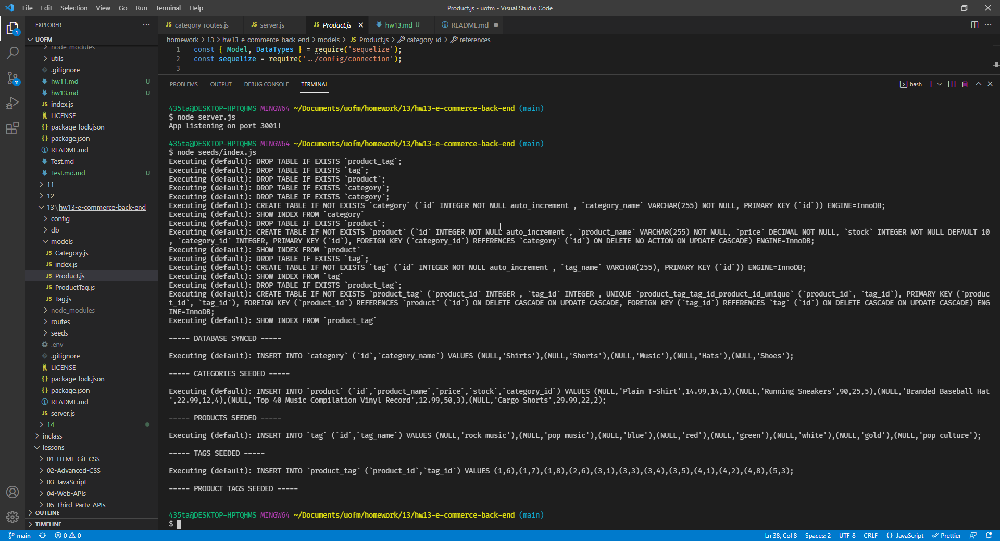
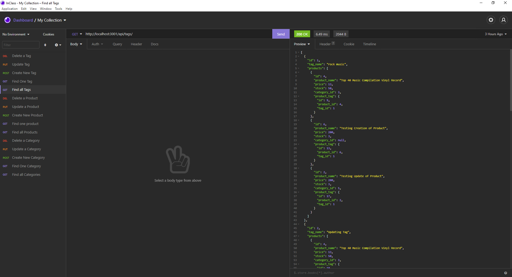

# hw13 e-Commerce Back End

## Description

In this application I am building the back end of a e-commerce website. Putting the routes together and linking everything so it will work in Insomnia. Using the routes to test if this application works.

## Table of Contents

- [Installation](#installation)
- [Usage](#usage)
- [License](#license)
- [Contribution](#contribution)
- [Test](#test)
- [Questions](#questions)

## Installation

You will pull it down to your machine and run npm i to install all packages used in this application. If it doesn't seem like it is running right you can always try installing all of the packages yourself.

## Usage

You can use this application to run a e-commerce database.

### Starting Server

### Seeding Server

### Insomnia Testing

## License

This project is under the MIT license.

## Contribution

Packages: dotenv, express, mysql2 and sequelize.

## Test

Test the application by starting the server and testing the routes in insomnia or any other program like that.

## Questions

My GitHub is: [TannerOliver](https://github.com/TannerOliver)
You can reach me at Email: 435.tanner@gmail.com

## Repository

[hw13_E-Commerce_Back-End](https://github.com/TannerOliver/hw13-e-commerce-back-end)

## Walk-Through

[Video_Link](https://drive.google.com/file/d/1ezWgghrbm1H9EXfSmaLDHQz3JmI6cAkH/view?usp=sharing)
